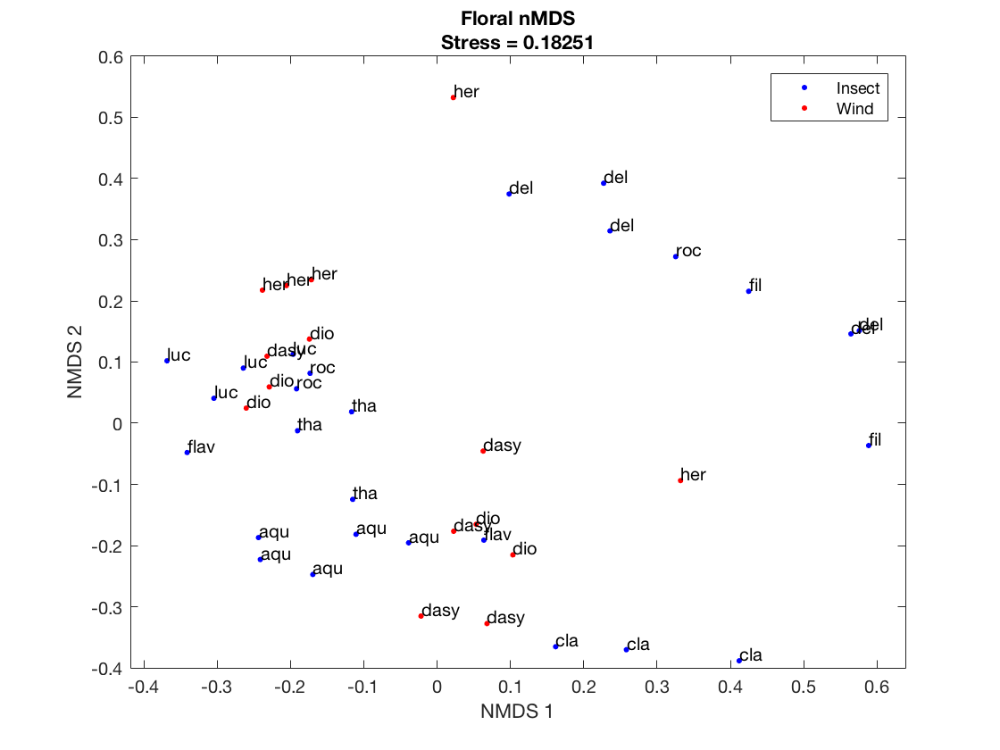

During my undergrad I had the fantastic oppertunity to help a fellow undergrad in the lab, Theresa Wang, with her thesis project. Her thesis was a collaberative project between Veronica Di Stilio and Jeff Riffel's lab to investigated the floral scent profiles between insect and wind pollinated species of *Thalictrum*. The paper was published last in [Annuals of Botany](https://academic.oup.com/aob/article/123/2/289/5056502) (Email me if you're stuck behind paywall). I joined the group while I was taking [BIOL 419: Data Science for Biologist](https://docs.wixstatic.com/ugd/b83b01_bb7ba7ff3216490eab0c86c628431108.pdf) my first every computing class; I need a project for the course and Theresa had some data just for that! The entire experiance really pushed me to learn skill that I am now utalizing in my Ph.D, as well as a nice change of pace from all the PCR I was running. 

The question we wanted to address was, **How similar/different are floral scent profiles between wind and insect pollinated species?** One classic way of addressing this question is to use non-multidimensional scaling (nMDS). This method reduce the pariwise disimilarities in low dimensional space (typically two-axis), similar to a Principle Component Analysis (PCA), theirby reducing the dimensionality of our multivariate data. However our data contains a confounding feature, each data point is realted to every other point by commmon decent, therefore similarity/difference could simply be due to close evolutionary relatedness. 

Below I will run through the scripts I wrote to perform nMDS and a subsequent pose I'll go through the scripts to run to test for [phylogenetic signal](https://jesusthebotanist.github.io/rambles/ScentR.html). These scripts are a slight modificaiton (typos fixed and more elaboration) from the published supplementary material found in this [github repo](https://github.com/Jesusthebotanist/Thalictrum-Floral-Scent). The nMDS analysis is written in Matlab (the language I learned in BIOL419) but the rest is written in R (I switched halfway through because R is free). 

## The Data

1) Floral scent analyzed by gas chromatography-mass spectrometry from 11 species of Thalictrum.

2) Electroantennogram (EAG) responses from buff-tailed bumblebee antenna exposed to floral scent extract from 8 *Thalictrum* species. I think this kind of data is really cool. 

## nMDS in Matlab
<head>
      <meta http-equiv="Content-Type" content="text/html; charset=utf-8">
   <!--
This HTML was auto-generated from MATLAB code.
To make changes, update the MATLAB code and republish this document.
      --><title>Matlab_NMDS_ANOSIM</title><meta name="generator" content="MATLAB 9.0"><link rel="schema.DC" href="http://purl.org/dc/elements/1.1/"><meta name="DC.date" content="2019-02-27"><meta name="DC.source" content="Matlab_NMDS_ANOSIM.m"></head><body>
<h2>Contents</h2>
<ul><li><a href="#1"><b>NMDS Analysis</b></a></li><li><a href="#2"><b>nMDS Plot</b></a></li><li><a href="#3"><b>1- Way ANOSIM</b></a></li><li><a href="#4">References</a></li></ul>
<h2><b>NMDS Analysis</b></h2>
NMDS was calculated with both built-in Matlab function 'mdscale' and the Fathom toolkit function 'F_nmds.' (Jones 2015). Similar results were obtained with both methods and we used 'mdscale' for all downstream analysis.
<pre class="codeinput">% Clear enviornment and read in data
clear all; close all; clc;
cd '/Volumes/GoogleDrive/My Drive/Projects/Jesusthebotanist.github.io';
floralData = readtable('assets/code/scent/compounds.csv');

% Move to the FathomToolBox folder to call relavant functions.
cd ..
cd '/Volumes/GoogleDrive/My Drive/Projects/Jesusthebotanist.github.io/assets/code/scent/FathomToolBox/'

% Extract only scent data
floralScent = floralData(:,8:end);
floralScent = table2array(floralScent).';

% Calculate Bray-Curtis distance with Fathom Package
F_dissimilaritiesBC = f_braycurtis(floralScent);

% 2-axis nMDS with Matlab 'mdscale'
[F_Y,F_stress,F_disparities] = mdscale(F_dissimilaritiesBC,2,...
    'criterion','stress','Start','random','Replicates',500);

% 2-axis NMDS with Fathom Package 'f_nmds'
F_Fathom_nmds = f_nmds(F_dissimilaritiesBC,2);

% Compare Stress Value Output of Floral Data Between Matlab and
% Fathom Functions
disp ({'Matlab mdscale function 2 Axis Floral stress value =', F_stress});
disp ({'Fathom f_nmds function 2 Axis Floral stress value =',...
        F_Fathom_nmds.stress});
</pre><pre class="codeoutput">Warning: Variable names were modified to make them valid MATLAB identifiers. 

---------------------------------------------------------
Selecting min STRESS from 10 random start configurations:
---------------------------------------------------------
29 iterations, Final stress criterion = 0.241458
29 iterations, Final stress criterion = 0.24884
40 iterations, Final stress criterion = 0.189437
68 iterations, Final stress criterion = 0.190346
30 iterations, Final stress criterion = 0.193859
55 iterations, Final stress criterion = 0.182521
32 iterations, Final stress criterion = 0.190076
36 iterations, Final stress criterion = 0.19389
22 iterations, Final stress criterion = 0.18319
33 iterations, Final stress criterion = 0.193855

Best configuration has STRESS = 0.1825212
---------------------------------------------------------
    'Matlab mdscale function 2 Axis...'    [0.1825]

    'Fathom f_nmds function 2 Axis ...'    [0.1825]

</pre><h2><b>nMDS Plot</b></h2>
Plot a 2D nNMDS. These points are for Figure 2b
<pre class="codeinput">% 2-Axis nMDS plot with Pollination Syndrome Labels
figure(1);
    gscatter(F_Y(:,1),F_Y(:,2),...
        (table2array(floralData(:,{'Pollination_Syndrome'}))),'br','..&gt;');
        legend('Insect','Wind');
        xlabel('NMDS 1');
        ylabel('NMDS 2');
        title({
             'Floral nMDS'
             ['Stress = ', num2str(F_stress)];
             });
    gname(table2array(floralData(:,{'Species_Name_Abbreviation'})));
</pre> <h2><b>1- Way ANOSIM</b></h2>
ANalysis Of SIMilarity (ANOSIM)is very similar to ANOVA, it is a method to determine if the means of grouping similar/different, however it is performed using the disimilarities rather than the raw data. We run ANOSIM grouping points by species (technical replicates) and by wind and insect pollinated taxa. We only find significance amongest species.
<pre class="codeinput">% ANOSIM - Group by Species
[F_r,F_p] = f_anosim(F_dissimilaritiesBC,...
            (table2array(floralData(:,{'F_name_number'}))),1,1000,1);

% ANOSIM - Group by Pollination syndrome
[FP_r, FP_p] = f_anosim(F_dissimilaritiesBC,...
               (table2array(floralData(:,{'Pollination_Syndrome'}))),...
               1,1000,1);
</pre><pre class="codeoutput">
Permuting the data 999 times...

==================================================
         1-way ANOSIM RESULTS:
--------------------------------------------------
Sorted Groupings:
 1   1   1   2   2   2   3   3   4   4   4   4   4   5   5   5   5   5   6   6   6   6   7   7   8   8   8   8   8   9   9   9  10  10  10  10  10  11  11  11  11  11

Global Test:
  R = 0.5377  p = 0.0010 (1000 of 2722995984137736495806098899535396864 possible perms) 

Pair-Wise Tests:
  1  2: R = 1.0000  p = 0.1000 (10 of 10 possible perms) 
  1  3: R = 1.0000  p = 0.1000 (10 of 10 possible perms) 
  1  4: R = 0.7641  p = 0.0179 (56 of 56 possible perms) 
  1  5: R = 1.0000  p = 0.0179 (56 of 56 possible perms) 
  1  6: R = 1.0000  p = 0.0286 (35 of 35 possible perms) 
  1  7: R = 0.7500  p = 0.1000 (10 of 10 possible perms) 
  1  8: R = 0.5692  p = 0.0179 (56 of 56 possible perms) 
  1  9: R = 0.8519  p = 0.1000 (10 of 10 possible perms) 
  1  10: R = 0.9077  p = 0.0179 (56 of 56 possible perms) 
  1  11: R = 0.8974  p = 0.0179 (56 of 56 possible perms) 
  2  3: R = 1.0000  p = 0.1000 (10 of 10 possible perms) 
  2  4: R = 0.0564  p = 0.2500 (56 of 56 possible perms) 
  2  5: R = 0.7641  p = 0.0179 (56 of 56 possible perms) 
  2  6: R = 0.7037  p = 0.0286 (35 of 35 possible perms) 
  2  7: R = 0.5833  p = 0.1000 (10 of 10 possible perms) 
  2  8: R = 0.2205  p = 0.1607 (56 of 56 possible perms) 
  2  9: R = 0.1111  p = 0.3000 (10 of 10 possible perms) 
  2  10: R = 0.7641  p = 0.0179 (56 of 56 possible perms) 
  2  11: R = 0.1077  p = 0.3214 (56 of 56 possible perms) 
  3  4: R = 1.0000  p = 0.0476 (21 of 21 possible perms) 
  3  5: R = 1.0000  p = 0.0476 (21 of 21 possible perms) 
  3  6: R = 1.0000  p = 0.0667 (15 of 15 possible perms) 
  3  7: R = 1.0000  p = 0.3333 ( 3 of  3 possible perms) 
  3  8: R = 0.9455  p = 0.0476 (21 of 21 possible perms) 
  3  9: R = 0.6667  p = 0.2000 (10 of 10 possible perms) 
  3  10: R = 0.5818  p = 0.0476 (21 of 21 possible perms) 
  3  11: R = 0.6545  p = 0.0476 (21 of 21 possible perms) 
  4  5: R = 0.3440  p = 0.0476 (126 of 126 possible perms) 
  4  6: R = 0.1500  p = 0.1508 (126 of 126 possible perms) 
  4  7: R = -0.0182  p = 0.4762 (21 of 21 possible perms) 
  4  8: R = 0.0600  p = 0.2857 (126 of 126 possible perms) 
  4  9: R = 0.2821  p = 0.0536 (56 of 56 possible perms) 
  4  10: R = 0.8000  p = 0.0079 (126 of 126 possible perms) 
  4  11: R = 0.0720  p = 0.2937 (126 of 126 possible perms) 
  5  6: R = 0.9875  p = 0.0079 (126 of 126 possible perms) 
  5  7: R = 0.6364  p = 0.0476 (21 of 21 possible perms) 
  5  8: R = 0.3760  p = 0.0159 (126 of 126 possible perms) 
  5  9: R = 0.7949  p = 0.0179 (56 of 56 possible perms) 
  5  10: R = 0.9800  p = 0.0079 (126 of 126 possible perms) 
  5  11: R = 0.4800  p = 0.0079 (126 of 126 possible perms) 
  6  7: R = 0.7857  p = 0.0667 (15 of 15 possible perms) 
  6  8: R = 0.5875  p = 0.0238 (126 of 126 possible perms) 
  6  9: R = 0.3333  p = 0.0571 (35 of 35 possible perms) 
  6  10: R = 0.8187  p = 0.0159 (126 of 126 possible perms) 
  6  11: R = 0.2750  p = 0.0159 (126 of 126 possible perms) 
  7  8: R = 0.2000  p = 0.1429 (21 of 21 possible perms) 
  7  9: R = -0.0000  p = 0.5000 (10 of 10 possible perms) 
  7  10: R = 0.8364  p = 0.0476 (21 of 21 possible perms) 
  7  11: R = -0.0364  p = 0.4762 (21 of 21 possible perms) 
  8  9: R = 0.3128  p = 0.0893 (56 of 56 possible perms) 
  8  10: R = 0.7760  p = 0.0079 (126 of 126 possible perms) 
  8  11: R = 0.4080  p = 0.0397 (126 of 126 possible perms) 
  9  10: R = 0.3641  p = 0.0893 (56 of 56 possible perms) 
  9  11: R = 0.1692  p = 0.1786 (56 of 56 possible perms) 
  10  11: R = 0.5400  p = 0.0238 (126 of 126 possible perms) 

==================================================

Permuting the data 999 times...

==================================================
         1-way ANOSIM RESULTS:
--------------------------------------------------
Sorted Groupings:
 1  1  1  1  1  1  1  1  1  1  1  1  1  1  1  1  1  1  1  1  1  1  1  1  1  1  1  2  2  2  2  2  2  2  2  2  2  2  2  2  2  2

Global Test:
  R = -0.0376  p = 0.2390 (1000 of 98672427616 possible perms) 

Pair-Wise Tests:
  1  2: R = -0.0376  p = 0.7210 (1000 of 98672427616 possible perms) 

==================================================
</pre><h2>References</h2>
Jones DL. 2015. <i>Fathom Toolbox for Matlab: software for multivariate ecological and oceanographic data analysis</i>. College of Marine Science, University of South Florida, St. Petersburg, FL, USA. <a href="http://www.marine.usf.edu/user/djones/">http://www.marine.usf.edu/user/djones/</a>

 <a href="http://www.mathworks.com/products/matlab/">Published with MATLAB&reg; R2016a</a> 

<!--
##### SOURCE BEGIN #####
%% *NMDS Analysis*
% NMDS was calculated with both built-in Matlab function 'mdscale' and the
% Fathom toolkit function 'F_nmds.' (Jones 2015). Similar results were 
% obtained with both methods and we used 'mdscale' for all 
% downstream analysis. 

% Clear enviornment and read in data
clear all; close all; clc;
cd '/Volumes/GoogleDrive/My Drive/Projects/Jesusthebotanist.github.io'; 
floralData = readtable('assets/code/scent/compounds.csv'); 

% Move to the FathomToolBox folder to call relavant functions. 
cd ..
cd '/Volumes/GoogleDrive/My Drive/Projects/Jesusthebotanist.github.io/assets/code/scent/FathomToolBox/'

% Extract only scent data
floralScent = floralData(:,8:end);
floralScent = table2array(floralScent).';

% Calculate Bray-Curtis distance with Fathom Package
F_dissimilaritiesBC = f_braycurtis(floralScent);
    
% 2-axis nMDS with Matlab 'mdscale'
[F_Y,F_stress,F_disparities] = mdscale(F_dissimilaritiesBC,2,...
    'criterion','stress','Start','random','Replicates',500); 

% 2-axis NMDS with Fathom Package 'f_nmds'
F_Fathom_nmds = f_nmds(F_dissimilaritiesBC,2);   

% Compare Stress Value Output of Floral Data Between Matlab and 
% Fathom Functions
disp ({'Matlab mdscale function 2 Axis Floral stress value =', F_stress});
disp ({'Fathom f_nmds function 2 Axis Floral stress value =',...
        F_Fathom_nmds.stress});
%% *nMDS Plot*
% Plot a 2D nNMDS. These points are for Figure 2b 

% 2-Axis nMDS plot with Pollination Syndrome Labels
figure(1);
    gscatter(F_Y(:,1),F_Y(:,2),...
        (table2array(floralData(:,{'Pollination_Syndrome'}))),'br','..>');
        legend('Insect','Wind');
        xlabel('NMDS 1');
        ylabel('NMDS 2');
        title({
             'Floral nMDS'
             ['Stress = ', num2str(F_stress)]; 
             });      
    gname(table2array(floralData(:,{'Species_Name_Abbreviation'})));
%% *1- Way ANOSIM* 
% ANalysis Of SIMilarity (ANOSIM)is very similar to ANOVA, it is a method 
% to determine if the means of grouping similar/different, however it is 
% performed using the disimilarities rather than the raw data. We run 
% ANOSIM grouping points by species (technical replicates) and by wind and
% insect pollinated taxa. We only find significance amongest species. 

% ANOSIM - Group by Species
[F_r,F_p] = f_anosim(F_dissimilaritiesBC,...
            (table2array(floralData(:,{'F_name_number'}))),1,1000,1);
           
% ANOSIM - Group by Pollination syndrome
[FP_r, FP_p] = f_anosim(F_dissimilaritiesBC,...
               (table2array(floralData(:,{'Pollination_Syndrome'}))),...
               1,1000,1);
           
%% References
% Jones DL. 2015. _Fathom Toolbox for Matlab: software for multivariate 
% ecological and oceanographic data analysis_. College of Marine Science, 
% University of South Florida, St. Petersburg, FL, USA. 
% http://www.marine.usf.edu/user/djones/

##### SOURCE END #####
-->